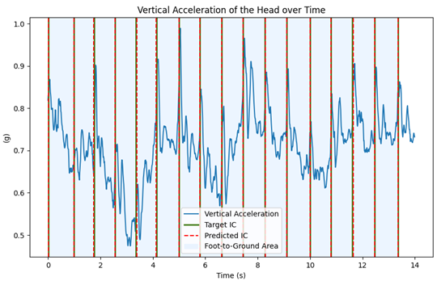
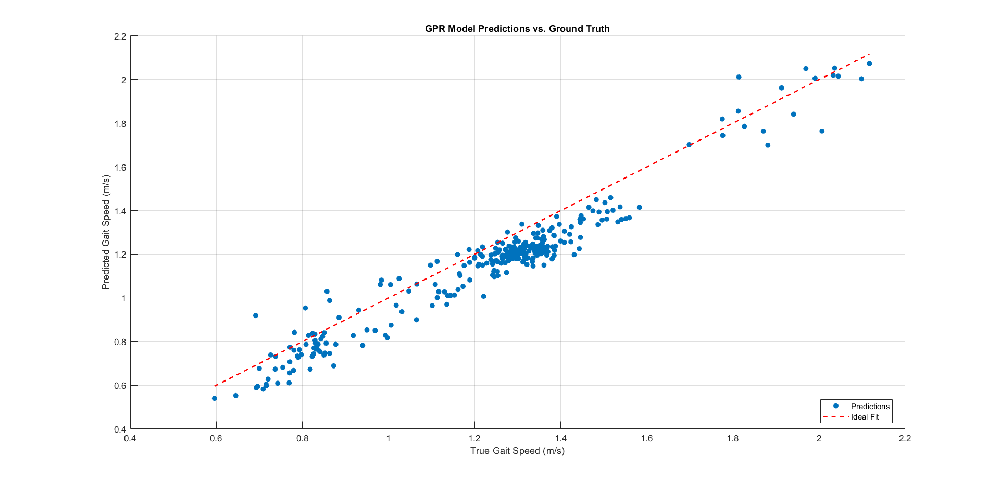
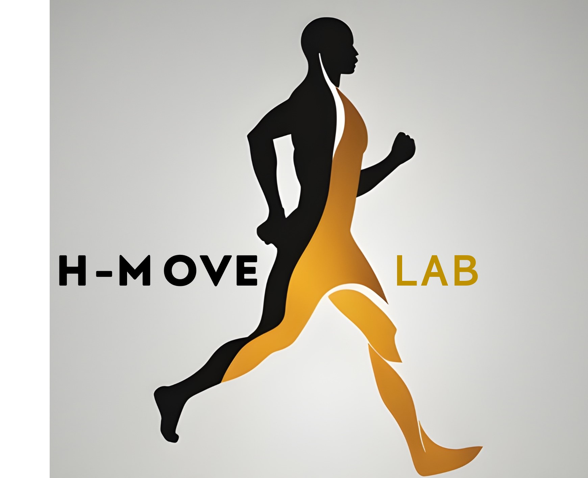

# `HeadGait` - Deep and Machine Learning Models for Initial Contacts Detection and Gait Speed Estimation with a Head-Worn Inertial Measurement Unit

Welcome to the `HeadGait` repository! This repository contains a basic example of a Matlab-Python application for the detection of initial contacts and the estimation of gait speed from acceleration and angular velocity data recorded by a Head-worn Inertial Measurement Unit (H-IMU). Raw data is preprocessed in Matlab, then initial contacts are detected by a Temporal Convolutional Network (TCN) trained with over 100.000 gait cyles in both structured and real-world conditions. Finally, gait speed is inferred by a Gaussian Process Regression (GPR) model fed with nine time-domain features extracted from the previously segmented gait cycles. 

The study design and the procedures for data collection, model training, optimization and evaluation are described in <a href="#1">[1]</a>

This project is based on [my-gait-events-tcn](https://github.com/rmndrs89/my-gait-events-tcn.git). The code for training (not included in the current project) and evaluating the model was adapted from the referenced repository.

## References
<a id="1">[1]</a> 
P. Tasca, F. Salis, S. Rosati, G. Balestra, A. Cereatti, 
*Estimating Gait Events and Speed in the Real World with a Head-Worn IMU*,
TechRxiv, 
January 29, 2024.
[https://doi.org/10.36227/techrxiv.170654480.02767120/v1](https://doi.org/10.36227/techrxiv.170654480.02767120/v1) <br><br>
<a id="2">[2]</a> 
P. Tasca, F. Salis, S. Rosati, G. Balestra, A. Cereatti,
*A machine learning-based pipeline for stride speed estimation with a head-worn inertial sensor*,
Gait & Posture,
Volume 105, Supplement 1,
2023,
Pages S47-S48,
ISSN 0966-6362,
[https://doi.org/10.1016/j.gaitpost.2023.07.341.](https://doi.org/10.1016/j.gaitpost.2023.07.341.) <br><br>
<a id="3">[3]</a> 
P. Tasca,
*A machine learning approach to spatio-temporal gait analysis based on a head-mounted inertial sensor*,
Supervisors: Andrea Cereatti, Gabriella Balestra, Samanta Rosati, Francesca Salis. Politecnico di Torino, 2022
[https://webthesis.biblio.polito.it/25348/](https://webthesis.biblio.polito.it/25348/) <br><br>
<a id="4">[4]</a>
R. Romijnders, F. Salis, C. Hansen, A. Küderle, A. Paraschiv-Ionescu, A. Cereatti, W. Maetzler *et al.*, *Ecological validity of a deep learning algorithm to detect gait events from real-life walking bouts in mobility-limiting diseases*, Frontiers in Neurology, 2023, [10.3389/fneur.2023.1247532. ](10.3389/fneur.2023.1247532. )

## Prerequisites

Ensure you have the following dependencies installed before running the application:

- **Matlab:** MATLAB R2022a or later.
- **Python:** Python 3.12, with the required libraries listed in `requirements.txt`.

## Usage (Windows)

Clone the repository to your local machine :

```bash
git clone https://github.com/H-MOVE-LAB/headgait.git
```

(Optional) We recommend creating a virtual environment with the required modules (example: `venv_headgait`) : 

```bash
python -m venv venv_headgait
venv_headgait\Scripts\activate     
pip install -r requirements.txt
```

Now, everything is set for you to start and play around!

1. **Matlab Pre-processing:**
   - Open the `preprocessing.m` script in Matlab. Be sure that `headgait\` is the current folder.
   - Run the script to perform pre-processing on the example raw data. This include filtering, scaling and windowing.
   - Verify that pre-processed data is correctly saved in location `example_data\preprocessed\data.mat`.
   
2. **Initial Contacts Detection:**
   - Open `headgait\` as a project in your IDE (suggested: PyCharm).
   - Open the `example_initial_contacts_detection.py` script in a Python environment.
   - Run the script to make inference on the pre-processed data and measure detection performance.


3. **Gait Speed Estimation:**
   - Open `example_gait_speed_estimation.m` in Matlab and set `headgait\` as the current folder.
   - Run the script to make inference on the data segmented using the previously detected initial contacts and estimate gait speed.


## Example Data

Example raw data is provided in the `example_data\` directory. Use this data to familiarize yourself with the application's workflow and as a reference for running the pre-processing and inference scripts. The full dataset [TO-Walk](https://dx.doi.org/10.21227/z3g5-nk54) is available on IEEE DataPort.

## Acknowledgments

This application was developed by the H-MOVE-LAB for human motion analysis. If you find this tool useful, consider citing our work or providing feedback to help us improve.

## Citation
```bash
@misc{headgait,
  author = {Paolo Tasca},
  title = {Deep and Machine Learning Models for Initial Contacts Detection and Gait Speed Estimation with a Head-Worn Inertial Measurement Unit},
  year = {2025},
  publisher = {GitHub},
  journal = {GitHub repository},
  howpublished = {\url{https://github.com/H-MOVE-LAB/headgait}},
}
```
<!--## License

This project is licensed under the [MIT License](LICENSE).-->

Feel free to reach out if you have any questions or encounter issues while using the application.

Happy analyzing!

[](https://github.com/H-MOVE-LAB)

